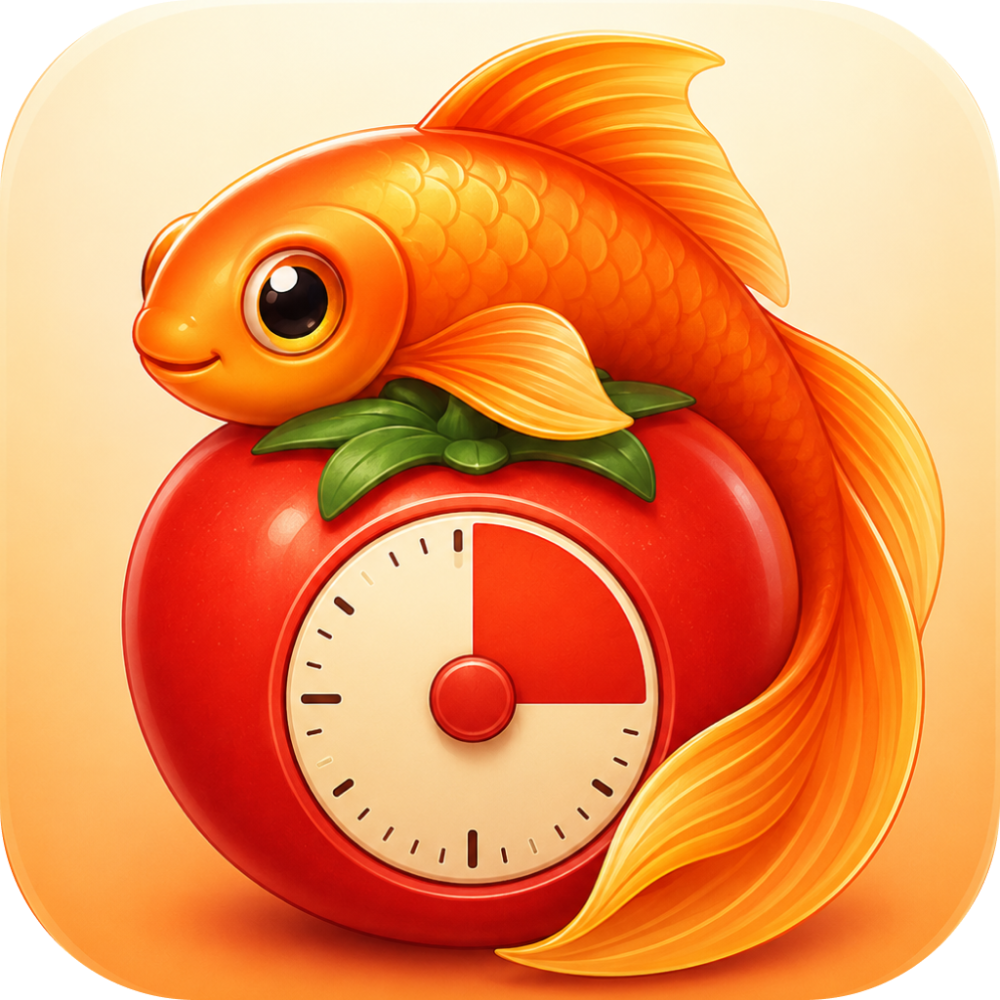

<div align="center">
  
  <h1>Goldfish</h1>
  <p>A dead-simple Pomodoro timer that floats over everything else.</p>
</div>

## Why "Goldfish"?

Because of my goldfish-brained ADHD. The whole point of this app is that the timer is
**always on top of every other app** - out of sight is out of mind, so it stays
in your face no matter what you're doing. A timer you have to go looking for is a
timer you forget about ten seconds after starting it.

## Principles

- **Stay on top.** The overlay floats above other (windowed) apps and doesn't
  disappear when you switch away. It dims to the background when you're not
  interacting with it, and goes solid when you click it.
- **Stay simple.** No accounts, no stats, no streaks, no shame ledger. It is
  present-tense by design - it only knows *now*. There's nothing to configure
  before you can start; just click "Start focus".

## What it does

A classic Pomodoro cycle, shown as a phase label, four progress dots, and a
monospace countdown:

<div align="center">
  
</div>

- Four focus blocks, each followed by a short **break**, with a longer break
  after the fourth - then it repeats.
- The card and the menu-bar dot are colour-coded by phase: tomato for focus,
  green/teal for breaks, amber when idle.
- At `0:00` it chimes and advances on its own. You can switch either hand-off to
  a manual "wait for me" with **Auto-start breaks** / **Auto-start focus**.

It runs as a **menu-bar agent** (no Dock icon). All control lives in the menu -
click the menu-bar dot, or right-click the overlay itself:

| Action | |
|---|---|
| Start focus / Take a break | move through the cycle |
| Pause / Resume | freeze the clock |
| Abandon | drop the current focus block (doesn't count) |
| Reset | end the whole cycle |
| Auto-start breaks / focus | toggle the automatic hand-offs |

Drag the overlay anywhere; it remembers where you put it.

## Configuration

Durations, window position, and the auto-start toggles are saved to a small,
hand-editable TOML file at `$XDG_CONFIG_HOME/goldfish/config.toml` (falling back
to `~/.config/goldfish/` or `~/.goldfish/`):

```toml
focus_minutes = 25
break_minutes = 5
long_break_minutes = 15
auto_start_breaks = true
auto_start_focus = true
```

## Building

macOS only. Needs [Go](https://go.dev), [Qt 6](https://formulae.brew.sh/formula/qt)
(`brew install qt`), and [Task](https://taskfile.dev).

```sh
task build        # build the binary into dist/
./dist/goldfish   # run it

task build:app    # package a self-contained dist/Goldfish.app bundle
task fix          # go fix + vet + gofmt
```

Built with Go and [miqt](https://github.com/mappu/miqt) (Qt 6 bindings).

## Installing

Goldfish is not notarized by Apple, so macOS Gatekeeper will block
it the first time - *"Goldfish is damaged and can't be opened"* or *"can't be
opened because it is from an unidentified developer"*. This is expected for a
self-built app.

Move `Goldfish.app` where you want it (e.g. `/Applications`) and clear the
quarantine flag once:

```sh
xattr -dr com.apple.quarantine /Applications/Goldfish.app
```

Then open it normally. (You only need to do this once per build/download - a
locally built bundle that you never download won't be quarantined at all.)

